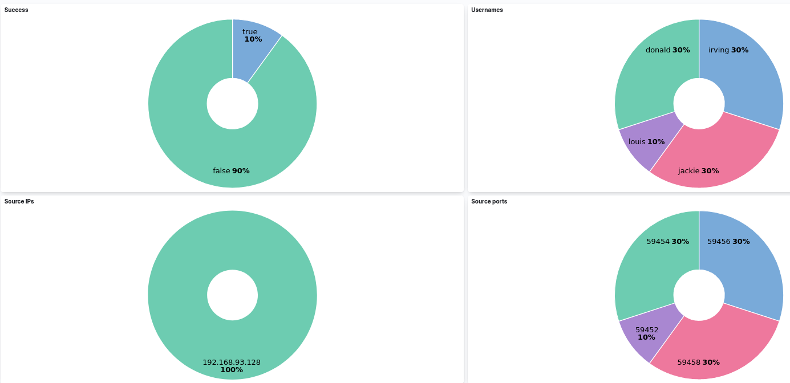

# SSH monitoring with ELK/rsyslog

## Prerequisites

OS : Ubuntu 16.04.7

ELK : 7.17.14

##

A log before/after parsing "message" field with Logstash/Grok. After building it,
you can now search on Kibana by SSH usernames, source IPs, success status...


```
{
	"host" => "127.0.0.1",
	"programname" => "sshd",
	"type" => "rsyslog",
	"sysloghost" => "ubuntu",
	"severity" => "info",
	"facility" => "auth",
	"@timestamp" => 2023-10-18T18:28:21.000Z,
	"@version" => "1",
	"message" => " Failed password for invalid user anonymat from 192.168.93.128 port 59010 ssh2",
	"procid" => "1800"
}
```

```
{
	"host" => "127.0.0.1",
	"programname" => "sshd",
	"type" => "rsyslog",
	"sysloghost" => "ubuntu",
	"severity" => "info",
	"facility" => "auth",
	"@timestamp" => 2023-10-18T18:28:21.000Z,
	"message" => " Failed password for invalid user anonymat from 192.168.93.128 port 59010 ssh2",
	"procid" => "1800",

	"ssh_username" => "anonymat",
	"ssh_version" => "2",
	"source_ip" => "192.168.93.128",
	"source_port" => "59010",
	"success" => "false"
}
```

  


